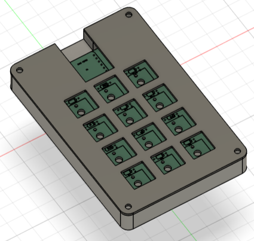
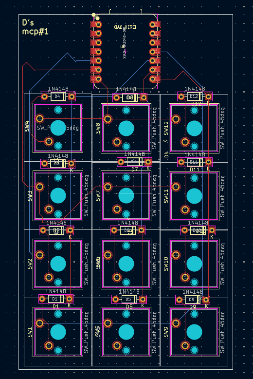
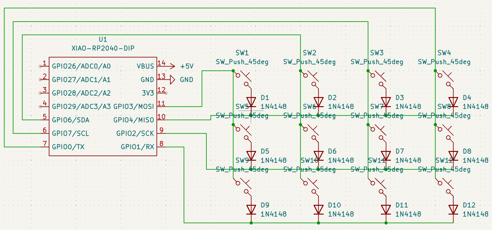
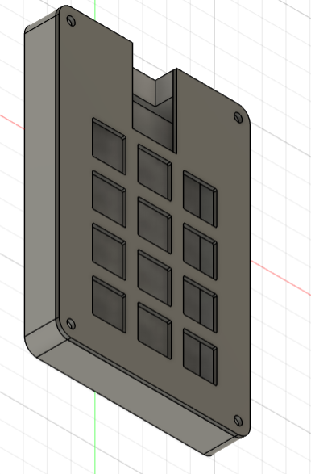

# D's mcp #1

### BOM
- 1x SEEED XIAO RP2040
- 12x MX-Style switches
- 12x Blank DSA keycaps
- 12x Through-Hole 1N4148 Diodes
- M3x16mm screws
### PCB Design

### Schematic Design

### Case Design

